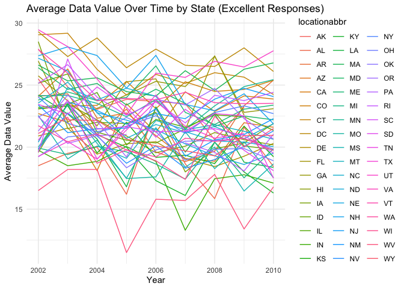
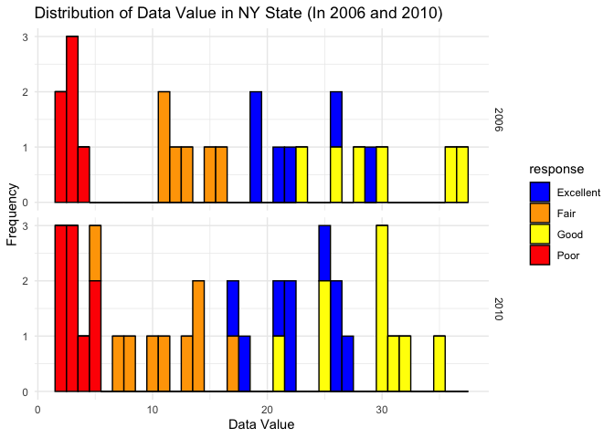

HW3
================
Tongxi Yu
2023-10-12

# Question 1

How many aisles are there, and which aisles are the most items ordered
from? Make a plot that shows the number of items ordered in each aisle,
limiting this to aisles with more than 10000 items ordered. Arrange
aisles sensibly, and organize your plot so others can read it. Make a
table showing the three most popular items in each of the aisles “baking
ingredients”, “dog food care”, and “packaged vegetables fruits”. Include
the number of times each item is ordered in your table. Make a table
showing the mean hour of the day at which Pink Lady Apples and Coffee
Ice Cream are ordered on each day of the week; format this table for
human readers (i.e. produce a 2 x 7 table).

``` r
library(p8105.datasets)
library(dplyr)
```

    ## 
    ## Attaching package: 'dplyr'

    ## The following objects are masked from 'package:stats':
    ## 
    ##     filter, lag

    ## The following objects are masked from 'package:base':
    ## 
    ##     intersect, setdiff, setequal, union

``` r
library(ggplot2)
data("instacart")
instacart = 
  instacart |> 
  as_tibble()
```

## How many aisles are there, and which aisles are the most items ordered from?

``` r
instacart |> 
  count(aisle) |> 
  arrange(desc(n))
```

    ## # A tibble: 134 × 2
    ##    aisle                              n
    ##    <chr>                          <int>
    ##  1 fresh vegetables              150609
    ##  2 fresh fruits                  150473
    ##  3 packaged vegetables fruits     78493
    ##  4 yogurt                         55240
    ##  5 packaged cheese                41699
    ##  6 water seltzer sparkling water  36617
    ##  7 milk                           32644
    ##  8 chips pretzels                 31269
    ##  9 soy lactosefree                26240
    ## 10 bread                          23635
    ## # ℹ 124 more rows

``` r
tail(names(sort(table(instacart$aisle_id))),1)
```

    ## [1] "83"

There are 134 aisles are there. Aisle 83 are the most items ordered
from.

## Make a plot that shows the number of items ordered in each aisle, limiting this to aisles with more than 10000 items ordered. Arrange aisles sensibly, and organize your plot so others can read it.

``` r
instacart |> 
  filter(aisle %in% c("baking ingredients", "dog food care", "packaged vegetables fruits")) |>
  group_by(aisle) |> 
  count(product_name) |> 
  mutate(rank = min_rank(desc(n))) |> 
  filter(rank < 4) |> 
  arrange(desc(n)) |>
  knitr::kable()
```

| aisle                      | product_name                                  |    n | rank |
|:---------------------------|:----------------------------------------------|-----:|-----:|
| packaged vegetables fruits | Organic Baby Spinach                          | 9784 |    1 |
| packaged vegetables fruits | Organic Raspberries                           | 5546 |    2 |
| packaged vegetables fruits | Organic Blueberries                           | 4966 |    3 |
| baking ingredients         | Light Brown Sugar                             |  499 |    1 |
| baking ingredients         | Pure Baking Soda                              |  387 |    2 |
| baking ingredients         | Cane Sugar                                    |  336 |    3 |
| dog food care              | Snack Sticks Chicken & Rice Recipe Dog Treats |   30 |    1 |
| dog food care              | Organix Chicken & Brown Rice Recipe           |   28 |    2 |
| dog food care              | Small Dog Biscuits                            |   26 |    3 |

# Question 2

``` r
library(p8105.datasets)
data("brfss_smart2010")
```

## Data Cleaning

``` r
brfss_smart2010 = brfss_smart2010 |>
  janitor::clean_names()

overall_health = brfss_smart2010 |>
  filter(topic == "Overall Health") |>
  filter(response %in% c("Poor", "Fair", "Good", "Very Good", "Excellent")) |>
  arrange(desc(response))
```

## In 2002, which states were observed at 7 or more locations? What about in 2010?

``` r
#2002 data
data2002 = overall_health |>
  filter(year == "2002") 

stateOver7_2002 <- data2002 |>
  group_by(locationabbr) |>
  summarise(locations_observed = n_distinct(locationdesc)) |>
  filter(locations_observed >= 7)
stateOver7_2002$locationabbr
```

    ## [1] "CT" "FL" "MA" "NC" "NJ" "PA"

``` r
#2010 data
data2010 = overall_health |>
  filter(year == "2010") 

stateOver7_2010 <- data2010 |>
  group_by(locationabbr) |>
  summarise(locations_observed = n_distinct(locationdesc)) |>
  filter(locations_observed >= 7)
stateOver7_2010$locationabbr
```

    ##  [1] "CA" "CO" "FL" "MA" "MD" "NC" "NE" "NJ" "NY" "OH" "PA" "SC" "TX" "WA"

“CT” “FL” “MA” “NC” “NJ” “PA” were observed at 7 or more locations in
2002 “CA” “CO” “FL” “MA” “MD” “NC” “NE” “NJ” “NY” “OH” “PA” “SC” “TX”
“WA” were observed at 7 ore more locations in 2010.

# Make a “spaghetti” plot of this average value over time within a state

``` r
excellent_data <- overall_health |>
  filter(response == "Excellent")

grouped_data <- excellent_data |>
  group_by(year, locationabbr) |>
  summarise(average_data_value = mean(data_value))
```

    ## `summarise()` has grouped output by 'year'. You can override using the
    ## `.groups` argument.

``` r
# 3. Create a "spaghetti" plot
ggplot(grouped_data, aes(x = year, y = average_data_value, group = locationabbr, color = locationabbr)) +
  geom_line() +
  labs(x = "Year", y = "Average Data Value", title = "Average Data Value Over Time by State (Excellent Responses)") +
  theme_minimal()
```

    ## Warning: Removed 3 rows containing missing values (`geom_line()`).

<!-- --> \# Make a
two-panel plot showing, for the years 2006, and 2010, distribution of
data_value for responses (“Poor” to “Excellent”) among locations in NY
State

``` r
subset_data <- overall_health |>
  filter(year %in% c(2006, 2010),locationabbr == "NY")

# Create a two-panel plot
ggplot(subset_data, aes(x = data_value, fill = response)) +
  geom_histogram(binwidth = 1, color = "black") +
  facet_grid(year ~ .) +
  labs(x = "Data Value", y = "Frequency", title = "Distribution of Data Value in NY State (In 2006 and 2010)") +
  scale_fill_manual(values = c("Poor" = "red", "Fair" = "orange", "Good" = "yellow", "Very Good" = "green", "Excellent" = "blue")) +
  theme_minimal()
```

<!-- -->
